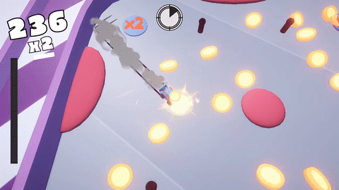
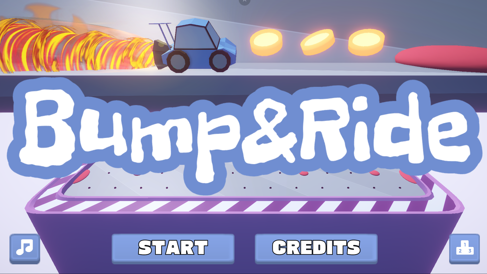
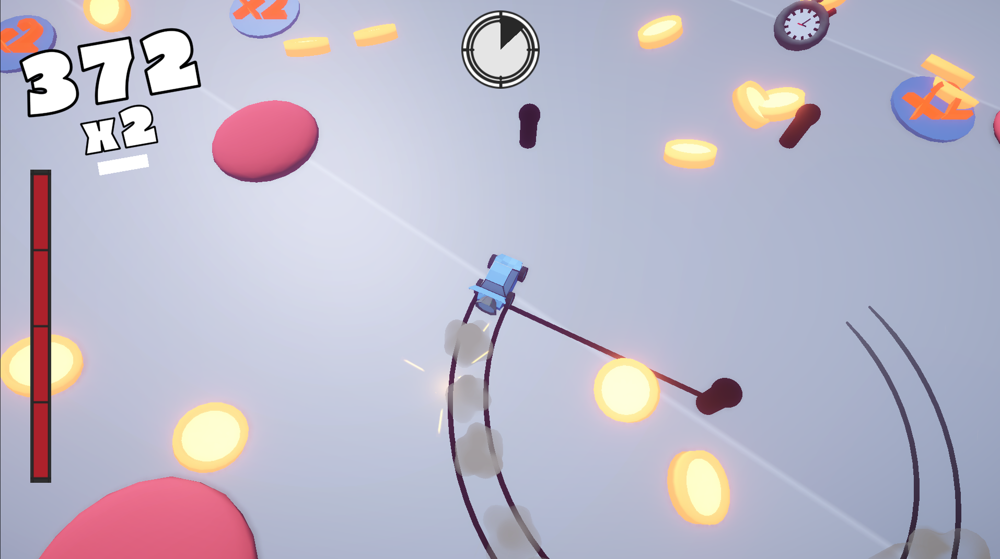

# racing-mayhem

Game made solo for ScoreSpace Game Jam #26 with theme "Collect". Settled on simple idea heavily inpsired by https://edgarmendoza.itch.io/parriba. Focused more on the idea that needs less programming and spent more time on the rest of the gamedevelopment. Even prepared a gif and some screenshots! Also mandatory leaderboard for the gamejam so I am quite happy as a solo project. Still used some assets from other creators (listed below).

I have used assets from:

Kenney (kenney.nl) - art, SFX, UI

Wenrexa (itch.io) - UI 

music by Of Far Different Nature (https://fardifferent.carrd.co)

sounds: 

suntemple (freesounds), Tom_Kaszuba (freesounds), strexet (freesounds), NXRT (freesounds), looneybits (opengameart), domasx2 (opengameart)